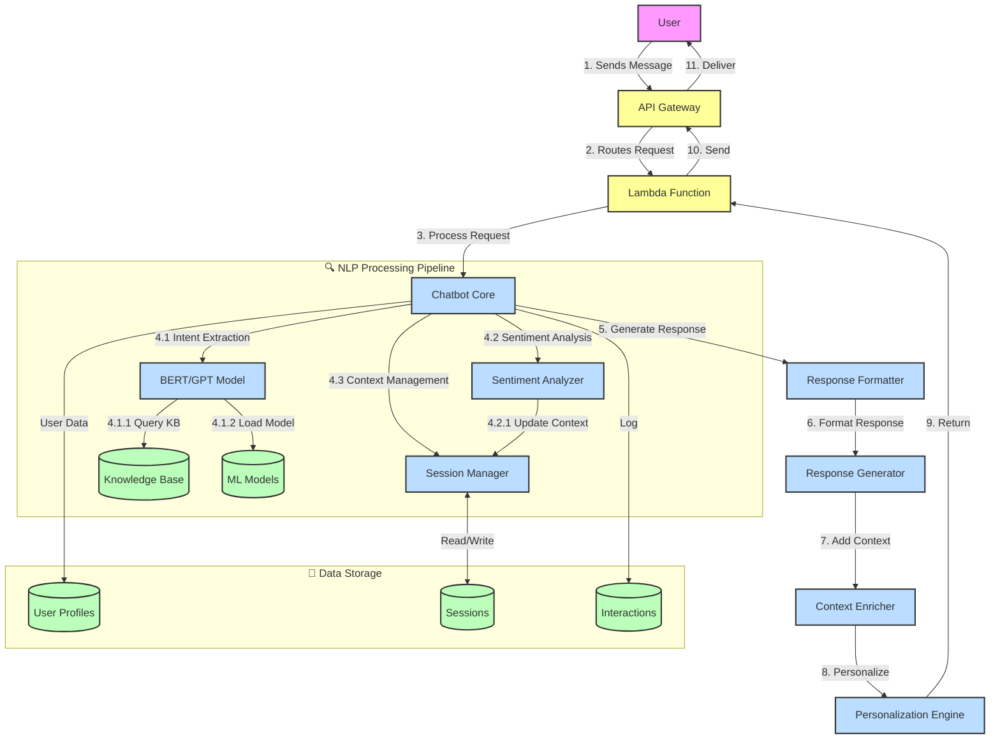

# 🤖 AI-Powered NLP Chatbot

A sophisticated AI-powered NLP chatbot built with Python, TensorFlow, and AWS services. This chatbot leverages state-of-the-art natural language processing to deliver intelligent, contextual, and personalized responses while ensuring enterprise-grade performance and scalability.

## 🏗 System Architecture

### High-Level Flowchart



### Detailed Flow Explanation

#### 1️⃣ User Interaction Layer
- **API Gateway**: Secure entry point for all requests
- **Request Validation**: Input sanitization and rate limiting
- **Authentication**: JWT token validation

#### 2️⃣ Core Processing Engine
- **Chatbot Core**: Central orchestrator for all operations
- **NLP Pipeline**:
  - **Intent Recognition**: BERT/GPT models for understanding user intent
  - **Entity Extraction**: Identify key information in user queries
  - **Sentiment Analysis**: Detect user emotion and tone
  - **Context Management**: Maintain conversation state

#### 3️⃣ Data Management
- **User Profiles**: Personalization and preferences
- **Session Storage**: Conversation history and context
- **Interaction Logs**: Analytics and improvement
- **Knowledge Base**: Domain-specific information
- **Model Storage**: ML models and embeddings

#### 4️⃣ Response Generation
- **Response Formatter**: Structure the response
- **Context Enricher**: Add relevant context
- **Personalization Engine**: Tailor responses to user preferences
- **Multi-modal Support**: Text, images, and rich content

#### 5️⃣ Performance & Monitoring
- **Real-time Analytics**: Track performance metrics
- **Error Handling**: Graceful degradation
- **Logging**: Comprehensive audit trail

## Features

- Natural Language Understanding using BERT/GPT models
- Real-time interaction support
- Personalized response algorithms
- Sentiment analysis
- User session management
- Scalable AWS infrastructure
- Performance metrics tracking
- Knowledge base integration

## Architecture

The system is built on a microservices architecture using:
- AWS Lambda for serverless compute
- API Gateway for REST API management
- DynamoDB for session and user data storage
- S3 for static content and model storage
- CloudWatch for monitoring and logging

## Performance Goals

- 50% reduction in query resolution time
- 15% improvement in customer satisfaction
- 30% decrease in support tickets
- Support for 100+ concurrent users

## Setup and Installation

1. Clone the repository
2. Install dependencies:
   ```bash
   pip install -r requirements.txt
   ```
3. Set up AWS credentials and environment variables
4. Configure the database connection
5. Deploy the infrastructure using AWS CDK

## Project Structure

```
├── app/
│   ├── api/            # FastAPI application
│   ├── core/           # Core business logic
│   ├── models/         # ML models and training
│   ├── services/       # External service integrations
│   └── utils/          # Utility functions
├── infrastructure/     # AWS CDK infrastructure code
├── tests/             # Test suite
└── scripts/           # Deployment and utility scripts
```

## Environment Variables

Create a `.env` file with the following variables:
```
AWS_ACCESS_KEY_ID=your_access_key
AWS_SECRET_ACCESS_KEY=your_secret_key
AWS_REGION=your_region
DATABASE_URL=your_db_url
MODEL_PATH=path_to_model
```

## API Documentation

The API documentation is available at `/docs` when running the server locally.

## Contributing

1. Fork the repository
2. Create a feature branch
3. Commit your changes
4. Push to the branch
5. Create a Pull Request

## License

MIT License 