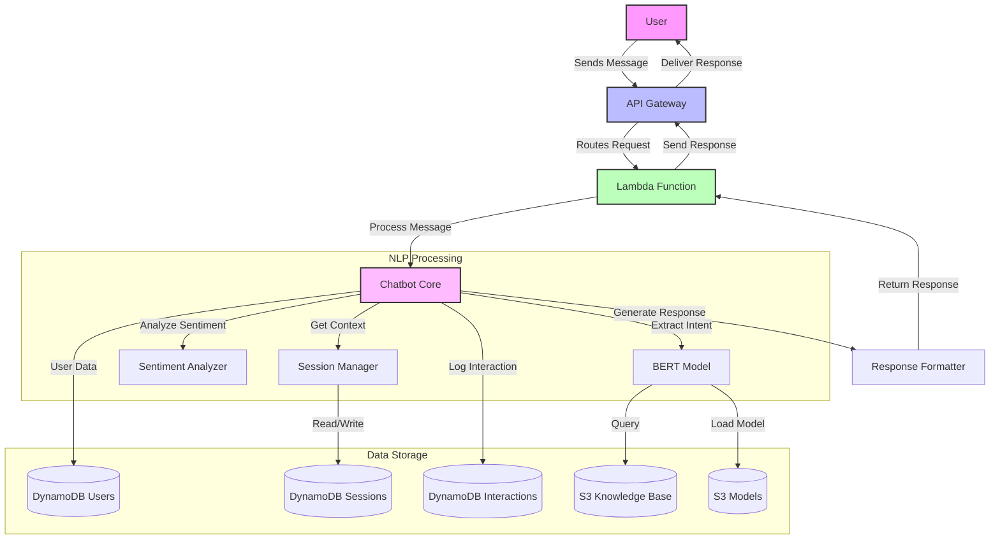

# AI-Powered NLP Chatbot

A full-featured AI-powered NLP chatbot built with Python, TensorFlow, and AWS services. This chatbot leverages advanced natural language processing capabilities to provide intelligent, personalized responses while maintaining high performance and scalability.

## System Architecture Flow



### Flow Description

1. **User Interaction**
   - User sends a message through the API Gateway
   - Request is routed to Lambda Function
   - Chatbot Core processes the message

2. **NLP Processing**
   - BERT Model extracts intent and entities
   - Sentiment Analyzer processes emotion
   - Session Manager maintains conversation context

3. **Data Storage**
   - DynamoDB tables store:
     - User profiles and preferences
     - Active sessions and context
     - Interaction history
   - S3 buckets store:
     - Knowledge base for responses
     - ML models and embeddings

4. **Response Generation**
   - Response Formatter creates personalized response
   - Response flows back through the system
   - User receives contextual reply

## Features

- Natural Language Understanding using BERT/GPT models
- Real-time interaction support
- Personalized response algorithms
- Sentiment analysis
- User session management
- Scalable AWS infrastructure
- Performance metrics tracking
- Knowledge base integration

## Architecture

The system is built on a microservices architecture using:
- AWS Lambda for serverless compute
- API Gateway for REST API management
- DynamoDB for session and user data storage
- S3 for static content and model storage
- CloudWatch for monitoring and logging

## Performance Goals

- 50% reduction in query resolution time
- 15% improvement in customer satisfaction
- 30% decrease in support tickets
- Support for 100+ concurrent users

## Setup and Installation

1. Clone the repository
2. Install dependencies:
   ```bash
   pip install -r requirements.txt
   ```
3. Set up AWS credentials and environment variables
4. Configure the database connection
5. Deploy the infrastructure using AWS CDK

## Project Structure

```
├── app/
│   ├── api/            # FastAPI application
│   ├── core/           # Core business logic
│   ├── models/         # ML models and training
│   ├── services/       # External service integrations
│   └── utils/          # Utility functions
├── infrastructure/     # AWS CDK infrastructure code
├── tests/             # Test suite
└── scripts/           # Deployment and utility scripts
```

## Environment Variables

Create a `.env` file with the following variables:
```
AWS_ACCESS_KEY_ID=your_access_key
AWS_SECRET_ACCESS_KEY=your_secret_key
AWS_REGION=your_region
DATABASE_URL=your_db_url
MODEL_PATH=path_to_model
```

## API Documentation

The API documentation is available at `/docs` when running the server locally.

## Contributing

1. Fork the repository
2. Create a feature branch
3. Commit your changes
4. Push to the branch
5. Create a Pull Request

## License

MIT License 